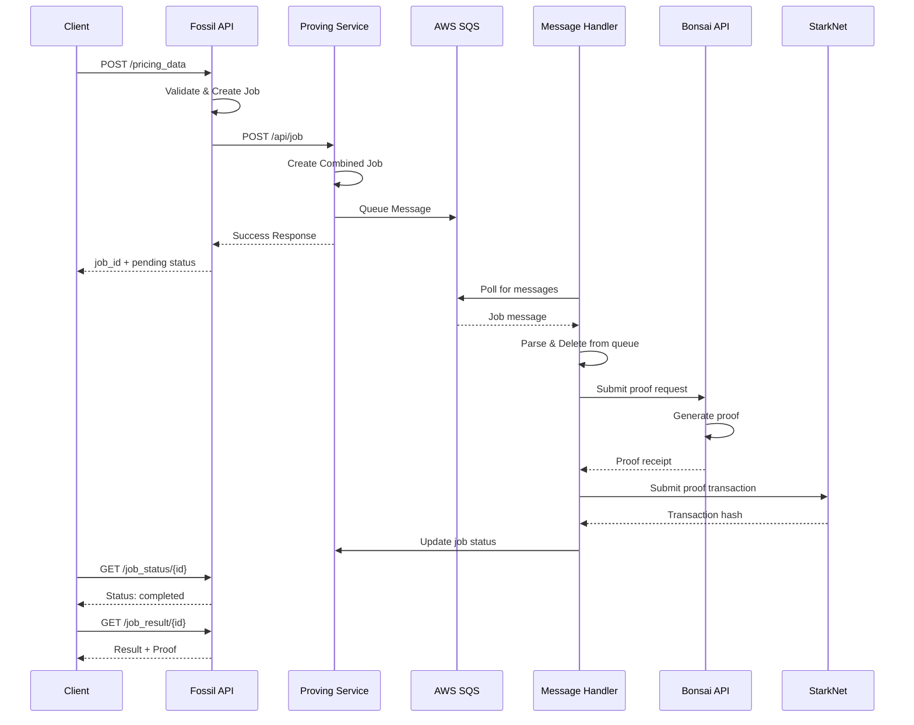
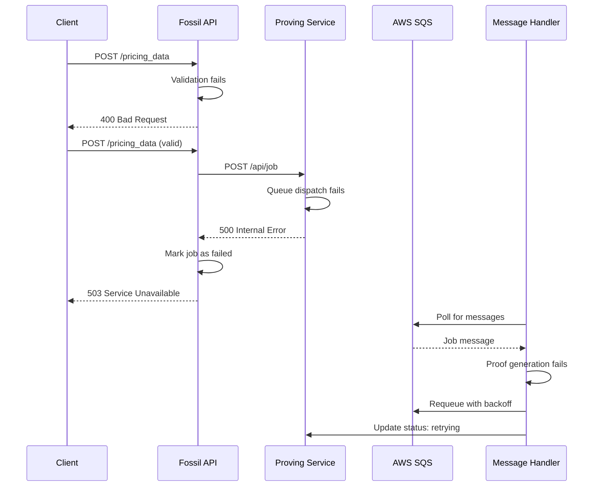

# Data Flow Documentation

This document describes the end-to-end data flow in the Fossil system, from the initial client request through proof generation to onchain verification.

## Table of Contents
- [Overview](#overview)
- [Component Flow](#component-flow)
- [Detailed Request Flow](#detailed-request-flow)
- [Sequence Diagrams](#sequence-diagrams)
- [Error Flows](#error-flows)
- [State Transitions](#state-transitions)

## Overview

The Fossil system processes pricing data requests through multiple stages, generating cryptographic proofs and submitting them to StarkNet for verification.

### System Components

1. **Fossil API**: Client-facing HTTP API for job management
2. **Proving Service API**: Internal API for proof job dispatch
3. **Message Handler**: Background worker for proof generation
4. **Database**: Job status and metadata storage
5. **SQS Queue**: Asynchronous job processing queue
6. **StarkNet**: Onchain proof verification

## Component Flow

### High-Level Data Flow

```
┌──────────┐   HTTP    ┌────────────┐   HTTP    ┌────────────────┐   SQS    ┌─────────────┐
│          │  Request  │            │  Forward  │                │  Queue   │             │
│  Client  │──────────▶│ Fossil API │──────────▶│ Proving Service│─────────▶│   Message   │
│          │           │            │           │      API       │          │   Handler   │
│          │◀──────────│            │◀──────────│                │◀─────────│             │
└──────────┘  Response └────────────┘  Response └────────────────┘  Status  └──────┬──────┘
                 │                          │                                       │
                 │                          │                                       │
                 ▼                          ▼                                       ▼
            ┌─────────┐              ┌─────────┐                             ┌──────────┐
            │Fossil DB│              │Proving  │                             │  Bonsai  │
            │         │              │Service  │                             │  API     │
            └─────────┘              │   DB    │                             │(RISC Zero)│
                                     └─────────┘                             └─────┬────┘
                                                                                    │
                                                                                    │ Proof
                                                                                    ▼
                                                                             ┌──────────────┐
                                                                             │   StarkNet   │
                                                                             │   Network    │
                                                                             └──────────────┘
```

## Detailed Request Flow

### Step 1: Client Request to Fossil API

A client sends a pricing data request to the Fossil API's HTTP endpoint:

```
POST http://localhost:3000/pricing_data
```

**Request Headers:**
```
Content-Type: application/json
X-API-Key: sk_test_xxxxx
```

**Request Body:**
```json
{
  "program_id": "RISC0_MOCK_PROOF_TEST",
  "vault_address": "0x004018ae0157b10d08cb1f70d34e32fd8b25e4ad1d70afc89616c3b300257fd9",
  "params": {
    "twap": [1672531200, 1672617600],
    "max_return": [1672531200, 1672617600],
    "reserve_price": [1672531200, 1672617600]
  }
}
```

**Parameters:**
- `program_id` - Proof program identifier
- `vault_address` - StarkNet vault contract address
- `params` - Timestamp ranges for each calculation:
  - `twap` - Time-weighted average price range
  - `max_return` - Maximum return calculation range
  - `reserve_price` - Reserve price calculation range

### Step 2: Fossil API Processing

**Actions:**
1. **Authenticate** request using API key from `X-API-Key` header
2. **Validate** request parameters (timestamps, addresses, etc.)
3. **Generate** unique `job_id` to track the request
4. **Store** job in Fossil API database with status `Pending`
5. **Transform** request into Proving Service format
6. **Forward** request to Proving Service API

**Database Record Created:**
```sql
INSERT INTO jobs (
  id,
  status,
  program_id,
  vault_address,
  params,
  created_at
) VALUES (
  'job_abc123',
  'pending',
  'RISC0_MOCK_PROOF_TEST',
  '0x004018ae...',
  '{"twap": [...], ...}',
  NOW()
);
```

**Response to Client:**
```json
{
  "job_id": "job_abc123",
  "status": "pending",
  "created_at": "2024-01-15T10:30:00Z"
}
```

### Step 3: Forward to Proving Service

The Fossil API calls the Proving Service API:

```
POST http://127.0.0.1:3000/api/job
```

With a transformed payload:
```json
{
  "job_group_id": "<job_id>",
  "twap": {
    "start_timestamp": 1672531200,
    "end_timestamp": 1672574400
  },
  "reserve_price": {
    "start_timestamp": 1672531200,
    "end_timestamp": 1672574400
  },
  "max_return": {
    "start_timestamp": 1672531200,
    "end_timestamp": 1672574400
  }
}
```

### Step 4: Proving Service API Handling

**Actions:**
1. **Receive** job request from Fossil API
2. **Create** combined job with ID format `combined_{job_group_id}`
3. **Store** job in Proving Service database
4. **Dispatch** job message to AWS SQS queue
5. **Respond** to Fossil API with success

**SQS Message Format:**
```json
{
  "job_id": "combined_job_abc123",
  "job_group_id": "job_abc123",
  "program_id": "RISC0_MOCK_PROOF_TEST",
  "vault_address": "0x004018ae...",
  "twap": {
    "start_timestamp": 1672531200,
    "end_timestamp": 1672617600
  },
  "reserve_price": {
    "start_timestamp": 1672531200,
    "end_timestamp": 1672617600
  },
  "max_return": {
    "start_timestamp": 1672531200,
    "end_timestamp": 1672617600
  }
}
```

**Response:**
```json
{
  "status": "success",
  "message": "Job dispatched successfully",
  "job_group_id": "job_abc123"
}
```

### Step 5: Message Handler Processing

The Message Handler continuously polls SQS and processes jobs:

**Polling Loop:**
```
1. Poll SQS queue (long polling, 20 second wait)
2. Receive message(s)
3. For each message:
   a. Parse job from message body
   b. Delete message from queue (prevent reprocessing)
   c. Spawn async task to handle job
```

**Job Processing:**
1. **Fetch Data** - Query database for historical pricing data
2. **Prepare Inputs** - Format data for RISC Zero guest program
3. **Generate Proof** - Call Bonsai API to generate RISC Zero proof
4. **Wait for Proof** - Poll Bonsai for proof completion (5 min timeout)
5. **Verify Proof** - Optional local verification
6. **Submit to StarkNet** - Send proof to StarkNet verifier contract
7. **Update Status** - Mark job as completed in database

**Timeout Handling:**
- If proof generation exceeds timeout, requeue job with backoff
- Maximum retry attempts: 3
- Backoff strategy: Exponential (1m, 2m, 4m)

### Step 6: Proof Generation (RISC Zero/Bonsai)

**Bonsai API Interaction:**
```
1. Submit proving request to Bonsai API
   - Program binary (ELF)
   - Input data (serialized)

2. Bonsai processes request
   - Executes guest program in zkVM
   - Generates cryptographic proof
   - Computes output journal

3. Poll for completion
   - GET /sessions/{session_id}/status
   - Returns: pending | running | succeeded | failed

4. Download proof artifacts
   - Receipt (proof + public outputs)
   - Seal (cryptographic proof data)
   - Journal (public outputs)
```

**Proof Structure:**
```rust
pub struct Receipt {
    pub image_id: [u8; 32],     // Program identifier
    pub journal: Vec<u8>,        // Public outputs
    pub seal: Vec<u8>,           // Proof data
}
```

### Step 7: StarkNet Verification

**Contract Interaction:**
```cairo
// Called by Message Handler
pub fn verify_and_store_proof(
    proof: Array<felt252>,
    public_inputs: Array<felt252>,
    vault_address: ContractAddress,
) -> bool
```

**Transaction Submission:**
1. **Prepare Transaction**
   - Encode proof data for StarkNet
   - Format public inputs (TWAP, max return, reserve price)
   - Set gas limits and fees

2. **Submit Transaction**
   - Call `verify_and_store_proof` on verifier contract
   - Wait for transaction acceptance
   - Monitor transaction status

3. **Confirmation**
   - Transaction hash returned
   - Poll for transaction receipt
   - Verify proof was accepted onchain

### Step 8: Status Update & Result Retrieval

**Database Updates:**
```sql
UPDATE jobs
SET status = 'completed',
    result = '{"twap": "...", "max_return": "...", "reserve_price": "..."}',
    proof_tx_hash = '0x...',
    completed_at = NOW()
WHERE id = 'job_abc123';
```

**Client Polling:**
```
GET /job_status/job_abc123

Response:
{
  "job_id": "job_abc123",
  "status": "completed",
  "created_at": "2024-01-15T10:30:00Z",
  "updated_at": "2024-01-15T10:35:00Z",
  "completed_at": "2024-01-15T10:35:00Z"
}
```

**Result Retrieval:**
```
GET /job_result/job_abc123
X-API-Key: sk_test_xxxxx

Response:
{
  "job_id": "job_abc123",
  "status": "completed",
  "result": {
    "twap": "156789.42",
    "max_return": "0.087",
    "reserve_price": "145000.00"
  },
  "proof": {
    "tx_hash": "0x1234...",
    "block_number": 12345,
    "verified": true
  }
}
```

## Sequence Diagrams

### Complete Request Flow



### Error Flow



## Error Flows

### Validation Errors

**Invalid API Key:**
```
Request: POST /pricing_data
X-API-Key: invalid_key

Response: 401 Unauthorized
{
  "error": "Invalid API key"
}
```

**Invalid Parameters:**
```
Request: POST /pricing_data
{
  "vault_address": "invalid",
  "params": { "twap": [0, -1] }
}

Response: 400 Bad Request
{
  "error": "Invalid timestamp range",
  "details": "End timestamp must be greater than start timestamp"
}
```

### Processing Errors

**Proof Generation Timeout:**
1. Job queued successfully
2. Message Handler starts proof generation
3. Bonsai API times out (> 5 minutes)
4. Job requeued with exponential backoff
5. Status updated to `retrying`
6. After 3 failures, status set to `failed`

**StarkNet Submission Failure:**
1. Proof generated successfully
2. Transaction submission to StarkNet fails
3. Message Handler retries submission
4. If persistent failure, job marked as `failed`
5. Proof retained for manual resubmission

### Recovery Strategies

**Queue Message Loss:**
- SQS visibility timeout prevents message loss
- If handler crashes, message becomes visible again
- Another handler picks up the message

**Database Connection Loss:**
- Connection pool automatically reconnects
- Queries retried with exponential backoff
- Failed operations logged for monitoring

## State Transitions

### Job State Machine

```
┌─────────┐
│         │
│ Pending ├────────┬──────────────────┐
│         │        │                  │
└────┬────┘        │                  │
     │             │                  │
     │ Queued      │ Validation       │ Queue
     ▼             │ Failed           │ Failed
┌──────────┐       │                  │
│          │       │                  │
│Processing├───────┤                  │
│          │       │                  │
└────┬─────┘       │                  │
     │             │                  │
     │ Success     ▼                  ▼
     │        ┌────────┐         ┌─────────┐
     │        │        │         │         │
     └───────▶│Complete│         │ Failed  │
              │        │         │         │
              └────────┘         └─────────┘
                                      ▲
                                      │
                                      │ Max retries
                                      │ exceeded
                                 ┌────┴────┐
                                 │         │
                                 │Retrying │
                                 │         │
                                 └─────────┘
```

### Valid State Transitions

| From | To | Trigger |
|------|-----|---------|
| `pending` | `processing` | Job picked up by handler |
| `pending` | `failed` | Validation failed |
| `processing` | `completed` | Proof verified onchain |
| `processing` | `retrying` | Timeout or temporary failure |
| `processing` | `failed` | Unrecoverable error |
| `retrying` | `processing` | Retry attempt started |
| `retrying` | `failed` | Max retries exceeded |

## Performance Characteristics

### Timing Expectations

| Stage | Duration | Notes |
|-------|----------|-------|
| API Request Validation | < 100ms | Fast synchronous validation |
| Job Queuing | < 500ms | Write to database + SQS |
| Queue Pickup | 1-20s | Long polling interval |
| Data Fetching | 1-5s | Database query for historical data |
| Proof Generation | 2-5 min | RISC Zero proof via Bonsai |
| StarkNet Submission | 30s-2min | Transaction inclusion time |
| **Total End-to-End** | **3-8 min** | Typical case |

### Scalability Considerations

**Bottlenecks:**
- Proof generation (sequential, CPU-intensive)
- StarkNet transaction finality (network-dependent)
- Database queries for large datasets

**Scaling Strategies:**
- Horizontal scaling of Message Handlers
- SQS queue buffering for bursty traffic
- Database read replicas for query performance
- Proof caching for repeated computations

## Next Steps

- [Architecture Overview](overview.md) - System architecture and components
- [Proving Service](proving-service.md) - Deep dive into proof generation
- [Fossil API](fossil-api.md) - API service architecture
- [API Reference](../api-reference/fossil-api-endpoints.md) - Complete API documentation 