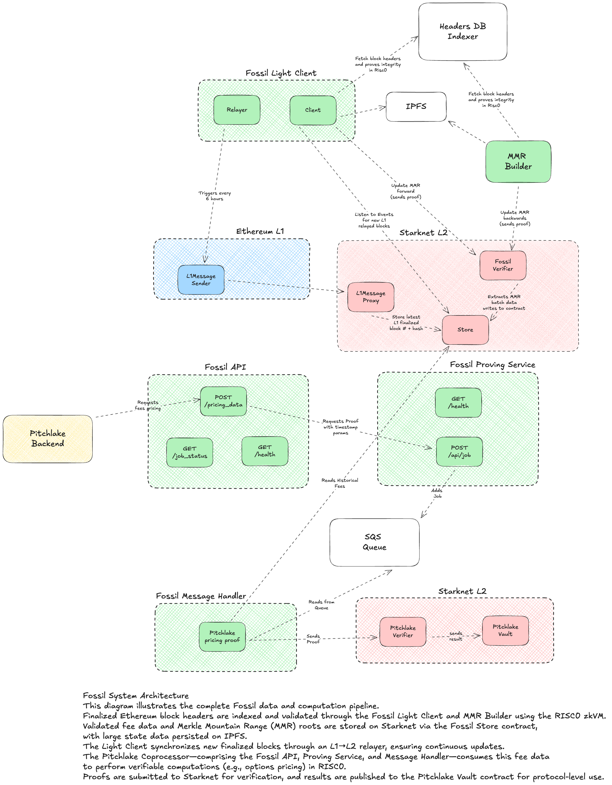

# Documentation Images

This directory contains architecture diagrams and images used in the documentation.

## Files

- `fossil-system-architecture.png` - Complete Fossil system architecture diagram showing:
  - Upstream Fossil infrastructure (Light Client, MMR Builder, Fossil Store)
  - Pitchlake Coprocessor (Fossil API, Proving Service, Message Handler)
  - StarkNet verification contracts
  - Complete data flow from Ethereum L1 to Pitchlake Vault

## Usage

Images are referenced in documentation using relative paths:

```markdown

```

## Adding New Images

1. Save image files to this directory
2. Use descriptive, kebab-case filenames
3. Reference in documentation with relative paths
4. Add entry to this README for documentation purposes
